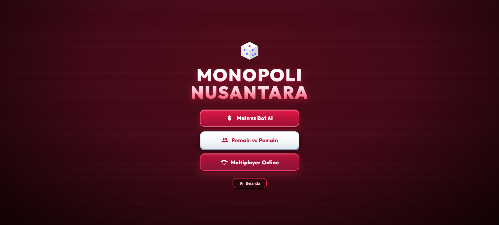
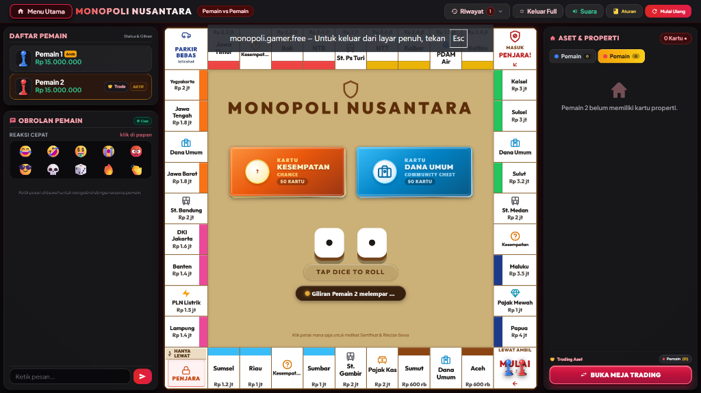

<div align="center">

# 🏛️ MONOPOLI NUSANTARA
### *Game Web Monopoli Interaktif Bertema Indonesia*

[](https://www.php.net/)
[](https://flightphp.com/)
[](https://tailwindcss.com/)
[](https://developer.mozilla.org/en-US/docs/Web/JavaScript)
[](LICENSE)

<br />

**Monopoli Nusantara** adalah adaptasi digital modern dari game papan legendaris Monopoli dengan tema kota dan provinsi di seluruh penjuru Indonesia. Dibangun dengan fokus pada performa cepat, visual 3D retro-modern yang imersif, dan dukungan lintas perangkat (PC Desktop, Laptop, Tablet, hingga Smartphone).

---

</div>

## 📸 Tampilan Antarmuka (Screenshots)

<div align="center">

### 🎮 Menu Utama (Main Menu)


<br/><br/>

### 🎲 Papan Permainan & Meja Trading (Game Board View)


</div>

---

## ✨ Fitur Unggulan

- 🇮🇩 **Edisi Nusantara Terlengkap**
  - Mengelilingi 22 aset properti provinsi & kota di Indonesia (mulai dari Aceh, DKI Jakarta, Yogyakarta, Bali, hingga Papua).
  - Dilengkapi Stasiun Kereta Api Nusantara (St. Gambir, St. Bandung, St. Ps Turi, St. Medan) serta Utilitas Publik (PLN Listrik & PDAM Air).

- 🕹️ **3 Mode Permainan Lengkap**
  1. **Main vs Bot AI**: Hadapi 1–3 lawan kecerdasan buatan dengan 3 pilihan tingkat kesulitan (*Mudah*, *Sedang*, *Pintar*).
  2. **Pemain vs Pemain (Pass & Play)**: Main santai bersama teman dan keluarga dalam 1 perangkat (2–4 pemain).
  3. **Multiplayer Online Real-time**: Buat ruangan privat dengan kode room unik, undang pemain lain secara online, atau isi slot kosong dengan Bot.

- 🎴 **Sistem Kartu Kesempatan & Dana Umum Berimbang**
  - Total 50 Kartu Unik dengan sistem distribusi probabilitas yang adil:
    - **30% Rugi**: Denda, biaya renovasi, atau tilang.
    - **30% Untung**: Dividen investasi, hadiah festival budaya, bonus pariwisata.
    - **30% Gacha & Kejutan**: Teleportasi ke stasiun, tukar posisi, atau tantangan seru.
    - **10% Kartu Sakti**: Kartu Bebas Penjara & Kartu Bebas Pajak (dapat disimpan di inventaris dan dipakai 1x).

- 🤝 **Sistem Trading Properti Interaktif**
  - Lakukan negosiasi jual-beli dan tukar tambah aset antar pemain secara langsung dengan penawaran uang tunai dan kartu sakti.

- 📱 **Desain Ultra Responsif (PC, Laptop & Mobile Ready)**
  - **PC / Laptop**: Tombol *Layar Penuh (Fullscreen)* otomatis, shortcut keyboard (`Spasi` untuk lempar dadu, `ESC` keluar fullscreen), layout widescreen 3 kolom.
  - **Mobile Smartphone**: *Bottom Navigation Bar* modern, slide-up drawers untuk daftar pemain, obrolan, dan sertifikat tanah tanpa scrolling mengganggu (*strict no-scroll view*).

- 🔊 **Efek Suara & Animasi 3D**
  - Dilengkapi animasi flip kartu 3D, efek lempar dadu, dentingan koin, sirine penjara, dan tombol kontrol audio cepat di navbar.

- 🛡️ **Panel Admin (/adminbanjar)**
  - Monitoring ruang multiplayer aktif, pembersihan ruangan kedaluwarsa (*cleanup*), dan Git management tool.

---

## 🛠️ Arsitektur & Teknologi

| Komponen | Teknologi yang Digunakan |
| :--- | :--- |
| **Backend Engine** | PHP 8.1+ dengan Flight PHP Micro-Framework |
| **Database** | MySQL / MariaDB (Mendukung fallback struktur tabel dinamis) |
| **Frontend UI** | HTML5, Tailwind CSS, Lucide Icons, Canvas Confetti |
| **Logika Game Client** | Modular Vanilla JavaScript (State Machine, Audio Synthesizer, Realtime Polling) |
| **Keamanan** | Automatic HTTPS Redirection via `.htaccess`, CSRF & Input Sanitization |

---

## 🚀 Panduan Instalasi Lokal

### Prasyarat:
- PHP >= 8.1
- MySQL / MariaDB
- Web Server (Apache via Laragon / XAMPP / PHP Built-in Server)
- Composer

### Langkah-langkah:

1. **Clone Repository**
   ```bash
   git clone https://github.com/Theseadev/Monopoly.git
   cd Monopoly
   ```

2. **Install Dependensi Composer**
   ```bash
   composer install
   ```

3. **Konfigurasi Database**
   - Buat database baru di MySQL bernama `monopoly_db`.
   - Import file database `database.sql` ke database Anda.
   - Sesuaikan kredensial di file [`app/config/database.php`](app/config/database.php):
     ```php
     return [
         'host' => '127.0.0.1',
         'dbname' => 'monopoly_db',
         'user' => 'root',
         'pass' => '',
         'port' => 3306
     ];
     ```

4. **Jalankan Aplikasi**
   - **Opsi A (Menggunakan Laragon / XAMPP):** Pindahkan folder project ke `www/` atau `htdocs/`, lalu akses di browser `http://localhost/Monopoly`.
   - **Opsi B (Menggunakan PHP Built-in Server):**
     ```bash
     php -S localhost:8000 index.php
     ```
     Buka browser Anda di `http://localhost:8000`.

---

## 📂 Struktur Direktori

```text
Monopoly/
├── app/
│   ├── config/          # Konfigurasi database & environment
│   ├── controllers/     # GameController (REST API) & AdminController
│   ├── core/            # GameState, AIPlayer, GameRules, RoomManager
│   ├── data/            # BoardData (Petak Nusantara) & CardsData (50 Kartu)
│   └── views/           # Template UI (board.php & admin.php)
├── assets/
│   ├── css/             # style.css (Styling papan, animasi 3D, responsive)
│   └── js/              # game.js (Game engine client-side & real-time sync)
├── docs/
│   └── screenshots/     # Gambar preview untuk dokumentasi
├── database.sql         # Skema database MySQL
├── index.php            # Routing & Entry point aplikasi
└── .htaccess            # Konfigurasi RewriteEngine & Auto HTTPS
```

---

## 📜 Aturan Singkat Permainan

1. Setiap pemain memulai dengan modal uang awal **Rp 15.000.000**.
2. Pemain melempar 2 dadu secara bergantian untuk melangkah mengelilingi papan.
3. Beli petak kota yang belum dimiliki untuk menarik uang sewa dari pemain lain yang singgah.
4. Kumpulkan seluruh petak dalam satu warna komplek (monopoli) untuk mulai membangun **Rumah** dan **Hotel**.
5. Jika dana tidak mencukupi, gadaikan properti atau lakukan negosiasi dagang (*Trade*) dengan pemain lain.
6. Pemain terakhir yang bertahan tanpa bangkrut keluar sebagai **Juara Monopoli Nusantara**! 🏆

---

## 🤝 Kontribusi & Lisensi

Kontribusi dan saran perbaikan fitur selalu terbuka! Silakan lakukan *Fork*, buat branch fitur Anda, dan kirimkan *Pull Request*.

Dilisensikan di bawah lisensi [MIT License](LICENSE).

<div align="center">
  <sub>Dibuat dengan ❤️ untuk melestarikan permainan papan klasik bernuansa Indonesia.</sub>
</div>
